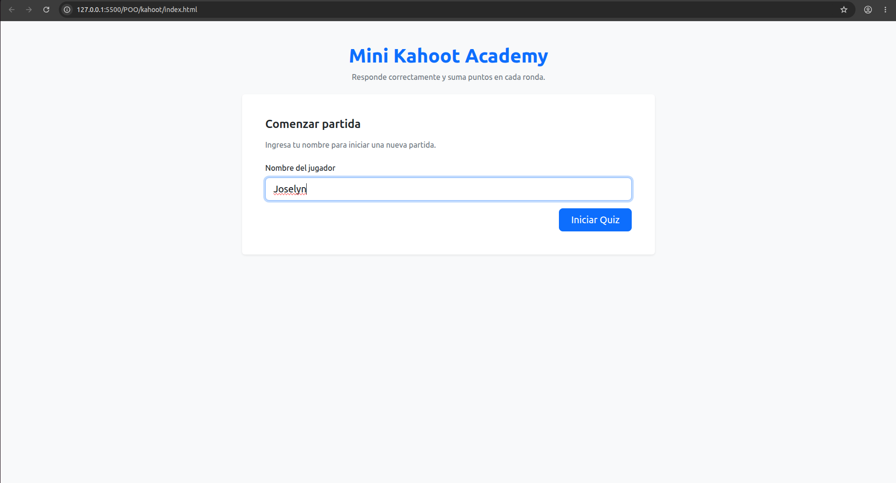
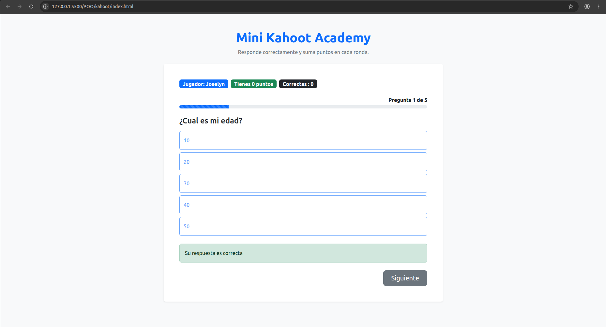
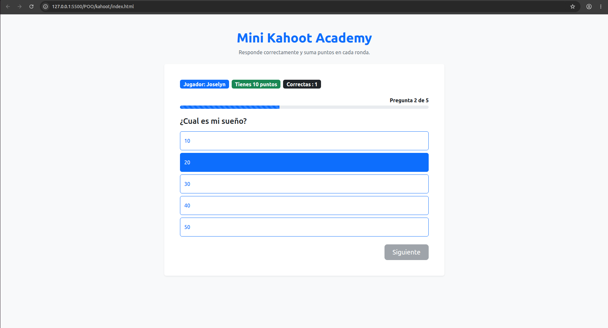
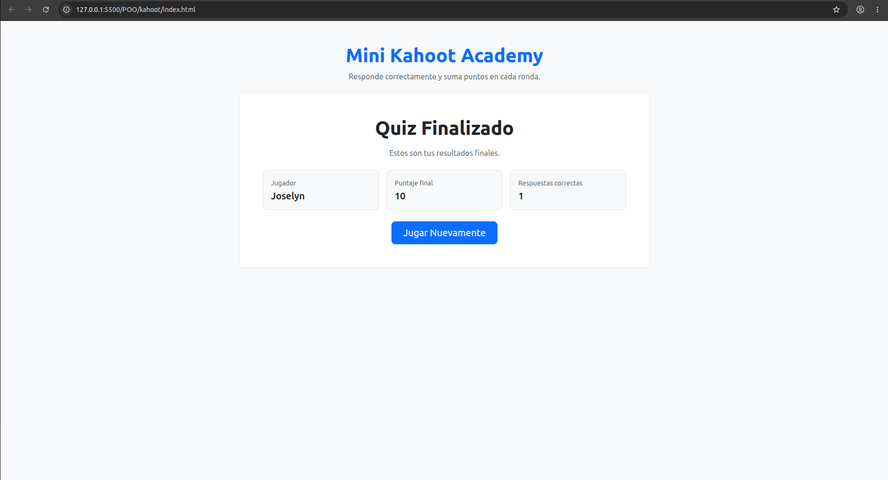

# 🎯 Quiz Interactivo

Aplicación web desarrollada con JavaScript orientado a objetos que permite a un jugador responder una serie de preguntas de opción múltiple, acumular puntos y visualizar sus resultados al finalizar.

## 🚀 Características

- Registro de nombre del jugador.
- Preguntas de opción múltiple.
- Validación de respuestas.
- Sistema de puntuación.
- Contador de respuestas correctas.
- Barra de progreso.
- Pantalla de resultados finales.
- Reinicio de partida.

## 🛠️ Tecnologías utilizadas

- HTML5
- CSS3
- Bootstrap 5
- JavaScript (POO)

## 📚 Conceptos aplicados

- Programación Orientada a Objetos (POO)
- Clases y objetos
- Encapsulamiento mediante propiedades privadas
- Getters y Setters
- Manipulación del DOM
- Eventos
- Modularización de responsabilidades

## 🎮 Cómo usar

1. Ingresa tu nombre.
2. Presiona **Iniciar**.
3. Responde las preguntas.
4. Visualiza tu puntaje al finalizar.
5. Reinicia el juego para volver a intentarlo.

---

Proyecto realizado con fines educativos para practicar JavaScript y Programación Orientada a Objetos.

